<!--
-------------------------------------------------------------------------------
This file defines the contents of each slide.
The reveal.js configuration can be found in index.html
-------------------------------------------------------------------------------
-->

<!-- .slide: class="slide-title" data-background-color="#000000" data-background-size="contain" -->

<!-- Place the content at the bottom of the slide -->

<h1 id="talk-title">
  Artrose Facetária
</h1>

  Vinícius Januário de Souza
  
CRM-SP: 23242  
  RQE: 14958

    

<!-- Place location and date side-by-side with affiliation logos -->

<!-- Add logos here. Need these wrappers to align them to the bottom right -->

===============================================================================
<h1>O que é Artrose Facetária?</h1>

  

    <ul>
      <li>Desgaste nas juntas da coluna</li>
      <li>Essas juntas ajudam a coluna a se mexer</li>
      <li>Acontece com o tempo ou por esforço demais</li>
    </ul>
  

  

    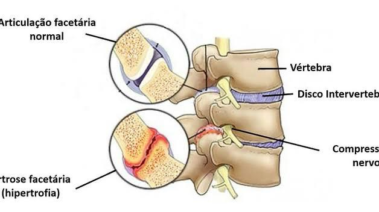
  

===============================================================================
<h1>O que é Artrose Facetária?</h1>

  

    <ul>
      <li>Desgaste nas juntas da coluna</li>
      <li>Essas juntas ajudam a coluna a se mexer</li>
      <li>Acontece com o tempo ou por esforço demais</li>
    </ul>
  

  

    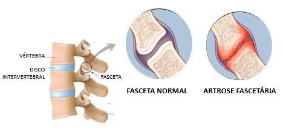
  

===============================================================================
<h1>O que é Artrose Facetária?</h1>

  

    <ul>
      <li>Desgaste nas juntas da coluna</li>
      <li>Essas juntas ajudam a coluna a se mexer</li>
      <li>Acontece com o tempo ou por esforço demais</li>
    </ul>
  

  

    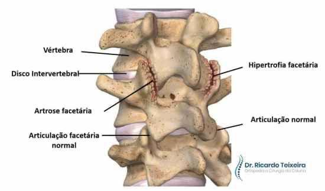
  

===============================================================================
<h1>O que é Artrose Facetária?</h1>

  

    <ul>
      <li>Desgaste nas juntas da coluna</li>
      <li>Essas juntas ajudam a coluna a se mexer</li>
      <li>Acontece com o tempo ou por esforço demais</li>
    </ul>
  

  

    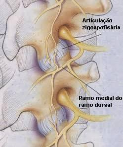
  

===============================================================================
<h1>O que é Artrose Facetária?</h1>

  

    <ul>
      <li>Desgaste nas juntas da coluna</li>
      <li>Essas juntas ajudam a coluna a se mexer</li>
      <li>Acontece com o tempo ou por esforço demais</li>
    </ul>
  

  

    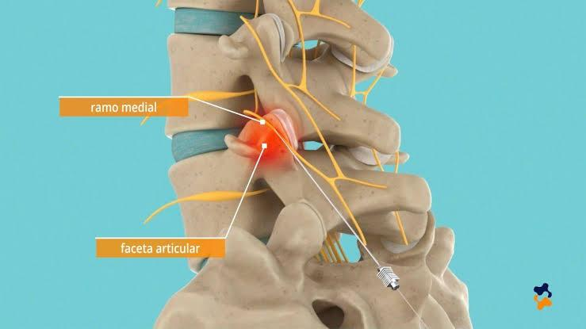
  

===============================================================================
<h1>Por que isso acontece?</h1>

  

    <ul>
    <li>Envelhecimento</li>
    <li>Má postura e sobrepeso</li>
    <li>Movimentos repetitivos ou lesões</li>
    </ul>
  

  

    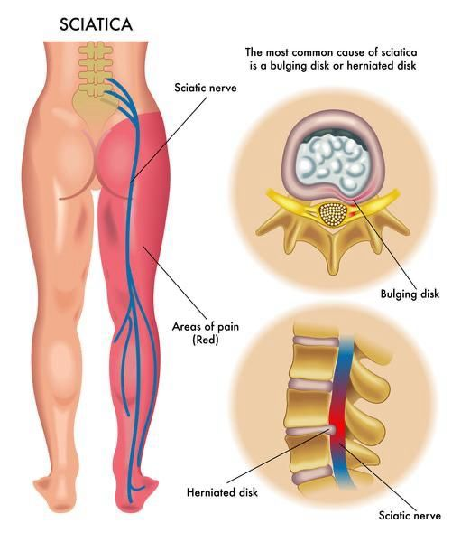
  

===============================================================================

<!-- .slide: data-background-image="assets/why_1.jpeg" data-background-size="contain" data-background-color="#000000" -->

===============================================================================
<h1>Por que isso acontece?</h1>

  

    <ul>
    <li>Envelhecimento</li>
    <li>Má postura e sobrepeso</li>
    <li>Movimentos repetitivos ou lesões</li>
    </ul>
  

  

    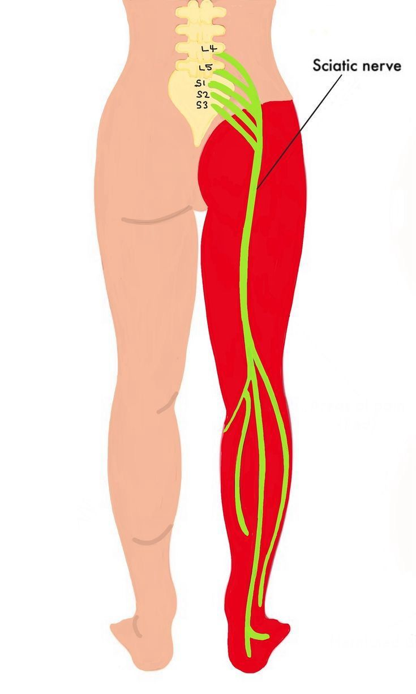
  

===============================================================================
<h1>Como você sente isso?</h1>
<ul>
  <li>Dor nas costas ou no pescoço</li>
  <li>Fica pior ao se mexer</li>
  <li>Às vezes trava ou irradia a dor</li>
</ul>

===============================================================================
<h1>Como o médico descobre?</h1>

  

    <ul>
      <li>Conversa + exame físico</li>
      <li>Exames de imagem: raio-x, ressonância etc.</li>
      <li>Injeção teste ajuda a confirmar</li>
    </ul>
  

  

    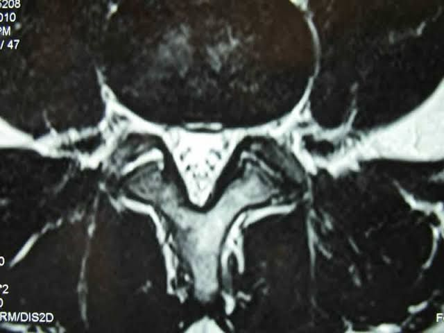
  

===============================================================================
<h1>Como o médico descobre?</h1>

  

    <ul>
      <li>Conversa + exame físico</li>
      <li>Exames de imagem: raio-x, ressonância etc.</li>
      <li>Injeção teste ajuda a confirmar</li>
    </ul>
  

  

    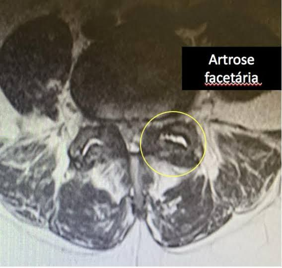
  

===============================================================================
<h1>Como o médico descobre?</h1>

  

    <ul>
      <li>Conversa + exame físico</li>
      <li>Exames de imagem: raio-x, ressonância etc.</li>
      <li>Injeção teste ajuda a confirmar</li>
    </ul>
  

  

    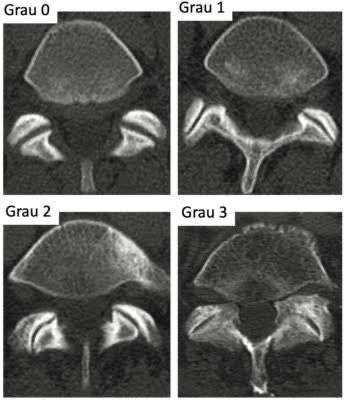
  

===============================================================================
<h1>Tratamentos sem cirurgia</h1>
<ul>
  <li>Fisioterapia</li>
  <li>Remédios e compressas</li>
  <li>Perder peso e melhorar postura</li>
</ul>

===============================================================================
<h1>Outros tratamentos</h1>

  

    <ul>
      <li><strong>Infiltração:</strong> injeção com anestésico e anti-inflamatório</li>
      <li><strong>Rizotomia:</strong> "desliga" o nervo da dor</li>
      <li>Feitos com anestesia local</li>
    </ul>
  

  

    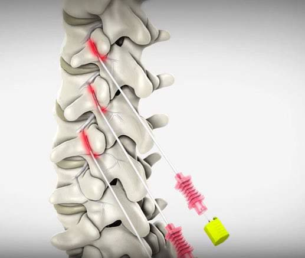
  

===============================================================================
<h1>Outros tratamentos</h1>

  

    <ul>
      <li><strong>Infiltração:</strong> injeção com anestésico e anti-inflamatório</li>
      <li><strong>Rizotomia:</strong> "desliga" o nervo da dor</li>
      <li>Feitos com anestesia local</li>
    </ul>
  

  

    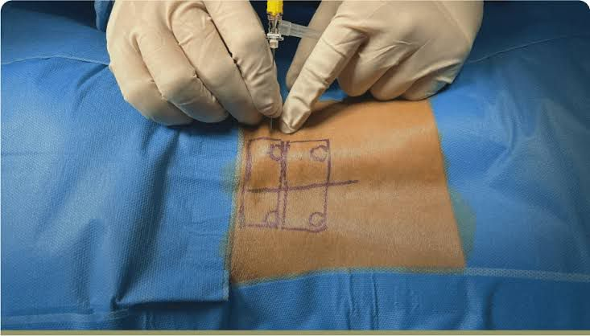
  

===============================================================================
<h1>Outros tratamentos</h1>

  

    <ul>
      <li><strong>Infiltração:</strong> injeção com anestésico e anti-inflamatório</li>
      <li><strong>Rizotomia:</strong> "desliga" o nervo da dor</li>
      <li>Feitos com anestesia local</li>
    </ul>
  

  

    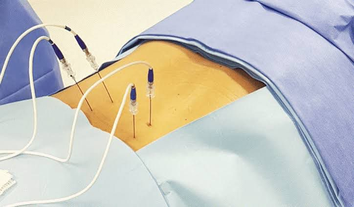
  

===============================================================================
<h1>Cirurgia (casos raros)</h1>
<ul>
  <li>Se nada mais funcionar</li>
  <li>Colar vértebras ou aliviar pressão</li>
  <li>Indicação bem avaliada</li>
</ul>

===============================================================================
<h1>E depois?</h1>
<ul>
  <li>Fortalecer músculos</li>
  <li>Boa postura e peso ideal</li>
  <li>Voltar ao médico regularmente</li>
</ul>

===============================================================================
<h1>O que é infiltração facetária?</h1>
<ul>
  <li>Injeção direto na junta da coluna</li>
  <li>Ajuda a aliviar e entender a dor</li>
  <li>Dura 10 a 20 minutos</li>
</ul>

===============================================================================
<h1>Pra que serve?</h1>
<ul>
  <li>Aliviar a dor</li>
  <li>Confirmar se a dor vem da faceta</li>
  <li>Reduzir remédios</li>
</ul>

===============================================================================
<h1>Como é feita?</h1>
<ol>
  <li>Deita de bruços</li>
  <li>Recebe anestesia local</li>
  <li>Agulha guiada por imagem</li>
  <li>Medicamento aplicado na articulação</li>
</ol>

===============================================================================
<h1>Vai doer?</h1>
<ul>
  <li>Desconforto leve</li>
  <li>Dor costuma melhorar rápido</li>
  <li>Pode sentir calor ou peso no local</li>
</ul>

===============================================================================
<h1>Cuidados depois</h1>
<ul>
  <li>Evitar esforço por 1 ou 2 dias</li>
  <li>Atividade leve no mesmo dia</li>
  <li>Observar febre ou dor forte</li>
</ul>

===============================================================================
<h1>O que esperar?</h1>
<ul>
  <li>Dor melhora por semanas ou meses</li>
  <li>Mais mobilidade</li>
  <li>Repetir ou passar para rizotomia se necessário</li>
</ul>

===============================================================================
<h1>Tem risco?</h1>
<ul>
  <li>Raros: infecção, sangramento, alergia</li>
  <li>Desconforto leve e passageiro</li>
  <li>Bem seguro com equipe especializada</li>
</ul>

===============================================================================
<h1>Resumo</h1>
<ul>
  <li>Infiltração é segura e eficaz</li>
  <li>Ajuda no controle da dor</li>
  <li>Parte de um plano de tratamento completo</li>
</ul>

===============================================================================
<h1>Obrigado</h1>